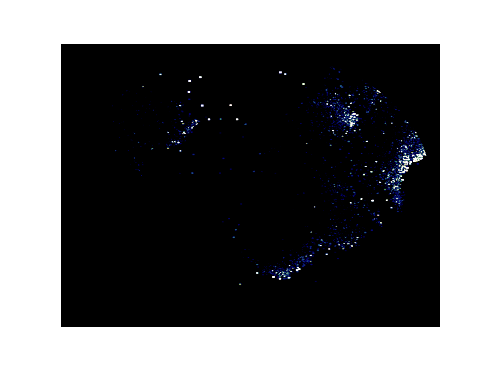

# FlowMIL

This is the code base for FlowMIL, Multi Instance Learning (MIL) based framework for Flow Cytometry (FCM) analysis.
This page includes
- [Installation](#installation)
- [Dataset Preparation](#dataset-preparation)
- [Preprocessing](#preprocessing)
- [Training](#training)
- [Hyperparameter Searching](#hyperparameter-searching)
- [Evaluation](#evaluation)
- [Visualization](#visualization)

FlowMIL is in its initial stage, please refer to zding20@jhu.edu for any questions and errors.
Paper work is [Application and Characterization of the Multiple Instance Learning Framework in Flow Cytometry](https://doi.org/10.1101/2025.06.10.658646).
## Installation

```
conda env create -f environment.yaml
conda activate flowmil_env
# optional for cudnn lib undetected
chmod +x fix_cuda.sh
fix_cuda.sh
```

## Dataset Preparation

TIL, HIVNH, and COVID datasets used can be accessed through [FlowRepository](https://flowrepository.org/).
AML dataset can be accessed through [cytobank](https://community.cytobank.org/cytobank/experiments).

- [TIL (CRCLC) dataset (FR-FCM-ZYWM)](https://flowrepository.org/id/FR-FCM-ZYWM)
- [HIVNH dataset (FR-FCM-ZZZK)](https://flowrepository.org/id/FR-FCM-ZZZK)
- [COVID dataset (FR-FCM-Z5PC)](https://flowrepository.org/id/FR-FCM-Z5PC)
- [AML dataset ](https://community.cytobank.org/cytobank/experiments/44185)

## Preprocessing

We provide data preprocessing process for TIL (CRCLC), HIVNH, AML simulated and COVID datasets. The dataset should be organized exactly as downloaded. Extra required files for this preprocessing step can be find at `./preprocessing_used_files`

- TIL dataset,
```
python preprocessing.py --dataset CRCLC --raw_data_dir TIL_RAW_DIR --data_saving_dir SAVING_DIR --CRCLC_channel_info ./preprocessing_used_files/Tcell_channel_info.xlsx 
```
- HIVNH dataset,
```
python preprocessing.py --dataset hivnh --raw_data_dir HIVNH_RAW_DIR --data_saving_dir SAVING_DIR --HIVNH_demographic ./preprocessing_used_files/clinical_data_flow_repository.csv
```
- AML dataset,
```
python preprocessing.py --dataset aml_2015 --raw_data_dir AML_RAW_DIR --AML2015_healthy_raw_dir HEALTHY_RAW_DIR --data_saving_dir SAVING_DIR --AML2015_gating --AML2015_recollection --AML2015_simulation_regeneration
```

- COVID dataset,

```
python preprocessing.py --dataset COVID --raw_data_dir COVID_RAW_DIR --data_saving_dir SAVING_DIR --COVID_demographic ./preprocessing_used_files/220115_Demographics_for_raw_data_upload.csv --sup_info_dir ./preprocessing_used_files --COVID_h5_generation
```

For details about the argment, refer to [Preprocessing Arguments](arguments.md#preprocessing-arguments)


## Training

Once the data is preprocessed, FlowMIL can be trained with the following command.

- For `mil_v0`, a minimal running example is 

```
python flowmil_main.py --dataset DATASET --dataset_dir DATASET_DIR --model mil_v0 --output_dir OUTPUT_DIR --validation --n_classes N_CLASSES --n_split 0 
```
Users are strongly encouraged to check the meaning and change 
`--inst_mlp_setting --instance_final_act --mil_v0_bag_logits_aggr --instance_aug --dropout --final_act --learning_rate --weight_decay --patience --max_epoch ` 
based on needs.

- For `abmil_sh`, a minimal running example is 
```
python flowmil_main.py --dataset DATASET --dataset_dir DATASET_DIR --model abmil_sh --output_dir OUTPUT_DIR --validation --n_classes N_CLASSES --n_split 0 
```
Users are strongly encouraged to check the meaning and change 
`--inst_mlp_setting --instance_final_act --abmil_att_encoding --inst_att_setting --instance_att_act --att_normalization --instance_aug --dropout --final_act --learning_rate --weight_decay --patience --max_epoch ` 
based on needs.

- For **multi-panel training**, now we only provide `COVID` dataset with a simple bag-level classifier of averaging the panel-level feature.
```
python flowmil_main.py --dataset COVID --dataset_dir DATASET_DIR --model mil_v0 --output_dir OUTPUT_DIR --validation --n_classes N_CLASSES --n_split 0 --COVID_task severity_prediction 
```
Arguments is similar to the single-panel case and should be checked in `flowmil_main.py`.

- We also provide `abmil_mh` `gmm` in current framework.

For details about the argment, refer to [Training Arguments](arguments.md#training-arguments).

After training, results can be find at `best_results.json` in the preserved model folders from `OUTPUT_DIR`.

## Hyperparameter Searching

Currently, FlowMIL uses a randomly hyperparameter searching process with example in `flowmil_hyperparameter_searching.py`.

## Evaluation
Evaluation process includes identifying experiment trails with best performance and extracting the instance attention logit. These two steps can work in either sequentially or seperatedly.

- For single-panel experiment, we wrap the evaluation process in `flowmil_post_training.py` for `CRCLC` and `hivnh` datasets. Assume the hyperparameter searched (or at least a cross-validated experiment trail) is done, then this post training process is
```
python flowmil_post_training.py --stat_training_results --instance_logits_extraction --output_dir OUTPUT_DIR --results_collection_dir RESULT_DIR_TO_CHECK 
```
For details about the argment, refer to [Evaluations and Attention Extraction](arguments.md#evaluations-and-attention-extraction).

- For `aml_2015` dataset, instance attention can be extracted through 
```
nohup python flowmil_main.py --dataset aml_2015 --model MODEL --phase evaluation --dataset_dir DIR_TO_NORMALIZED_CELLS --task regression --inst_att_extraction --dropout DROPOUT --inst_mlp_setting INST_MLP_SETTING --inst_att_setting INST_ATT_SETTING --validation --output_dir OUTPUT_DIR --model_loading_dir BEST_MODEL_DIR --abmil_att_encoding ATT_ENCODING_SETTING --att_normalization ATT_NORMALIZATION_SETTING --instance_final_act INSTANCE_FINAL_ACT --instance_att_act INSTANCE_ACT --mil_v0_bag_logits_aggr MIL_V0_NORMALIZATION
```
where these settings can be find from `BEST_MODEL_DIR/settings.json` except `--dataset_dir` where the normalized real cells are used. 

- For `COVID` dataset, single panel attention extraction is similar to example of `CRCLC` dataset. For multi-panel, an example is 
```
nohup python flowmil_main.py --dataset COVID --model MODEL --phase evaluation --dataset_dir DIR_TO_NORMALIZED_CELLS --task classification --return_sample_info --inst_att_extraction_multi_tube --n_split N_SPLIT --dropout DROPOUT --inst_mlp_setting_1 MLP_SETTING_1 --inst_mlp_setting_2 MLP_SETTING_2 --inst_mlp_setting_3 MLP_SETTING_3 --inst_mlp_setting_4 MLP_SETTING_4 --validation  --output_dir OUTPUT_DIR --model_loading_dir BEST_MODEL_DIR --mil_v0_bag_logits_aggr MIL_V0_NORMALIZATION --instance_final_act INSTANCE_FINAL_ACT --COVID_task severity_prediction --selected_panels LIST_OF_SELECTED_PANELS
```
Notice that for multi-panel `abmil_sh` or other models, the attention extraction process has not been fully investigated so far.

## Visualization

For visualization, we provide visualization in UMAP space and selected channels based on `flowmil_visualization.py`. The UMAP visualization tool is modified from [Spatial UMAP paper](https://pubmed.ncbi.nlm.nih.gov/34433588/), where weighted histogram is visualized in UMAP space.

- Visualization of the learned instance attention in UMAP space
```
nohup python flowmil_visualization.py --dataset DATASET --loading_dir LOADING_DIR --saving_dir SAVING_DIR --umap_attention_plotting --cross_split_plotting
```
<p align="center">
  
  
  <br>
  <em>Cellular attentions from a FlowMIL model, TIL dataset.</em>
</p>

- Visualization of the biomarker reaction in UMAP space
```
nohup python flowmil_visualization.py --dataset DATASET --loading_dir LOADING_DIR --saving_dir SAVING_DIR --umap_channel_plotting --cross_split_plotting --selected_channels SELECTED_CHANNELS
```
<p align="center">
  
  
  <br>
  <em>Cellular biomarker CD127 and CD103 reactions, TIL dataset.</em>
</p>
- Visualization of the phenotypic relations in UMAP space
```
nohup python flowmil_visualization.py --dataset DATASET --loading_dir LOADING_DIR --saving_dir SAVING_DIR --umap_phenotype_plotting --cross_split_plotting
```
<p align="center">
  
  
  <br>
  <em>Cellular phenotypic distribution, TIL dataset.</em>
</p>

- Visualization for combination of phenotypic label and biomarker reactions in UMAP space
```
nohup python flowmil_visualization.py --dataset DATASET --loading_dir LOADING_DIR --saving_dir SAVING_DIR --biomarker_reaction_plotting --cross_split_plotting --selected_channels SELECTED_CHANNELS
```
<p align="center">
  
  
  <br>
  <em>Cellular phenotypic-specific CD127 distribution, TIL dataset.</em>
</p>

- Visualization for using the instance logits to filtering sensitive cells in selected feature space
```
nohup python flowmil_visualization.py --dataset DATASET --loading_dir LOADING_DIR --saving_dir SAVING_DIR --channelwise_att_clean --cross_split_plotting --selected_channels SELECTED_CHANNELS
```
<p align="center">
  
  
  <br>
  <em>Biomarker reactions for cells before and after attention-based gating, TIL dataset.</em>
</p>

- Visualization for biomarker reactions for each phenotype
```
nohup python flowmil_visualization.py --dataset DATASET --loading_dir LOADING_DIR --saving_dir SAVING_DIR --attention_channel_combination --cross_split_plotting
```

- We also provide API which can be easily extended to the sample-specific visualization based on `--sample_specific_plotting`.

For details about the argment, refer to [Visualization](arguments.md#visualization).